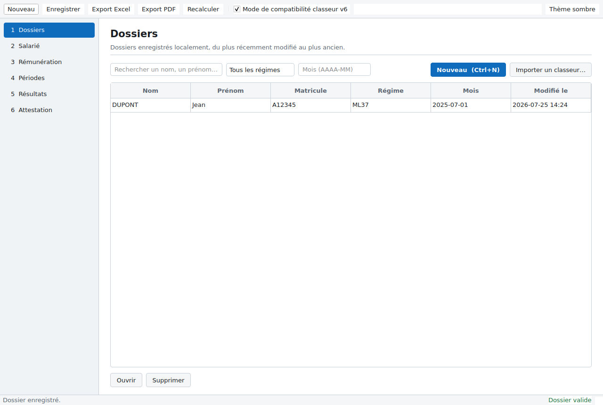
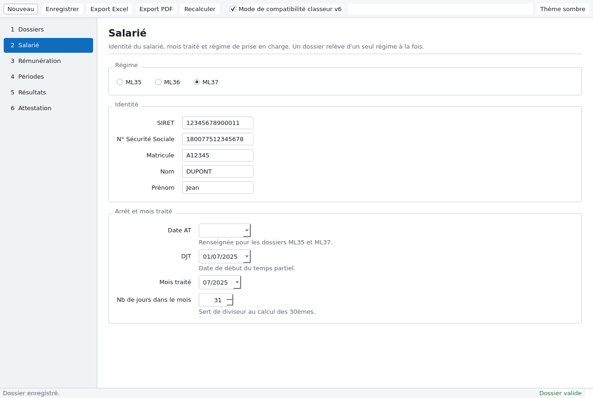
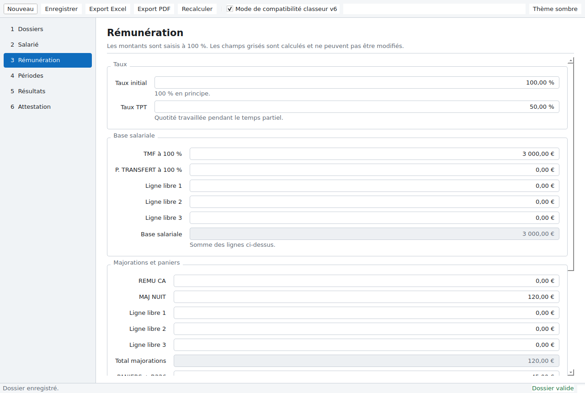
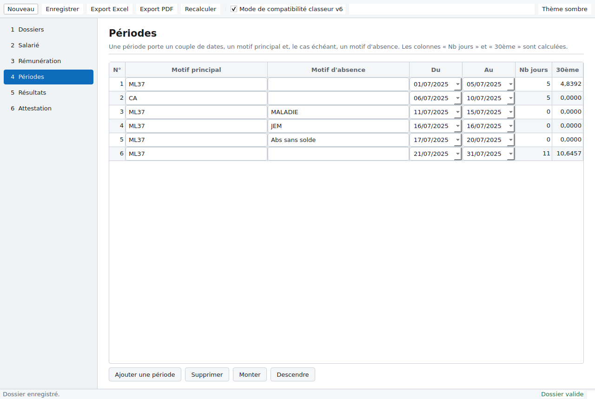
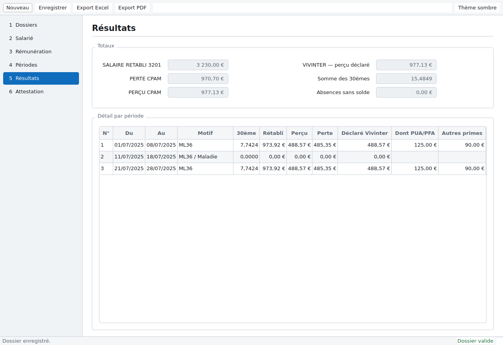
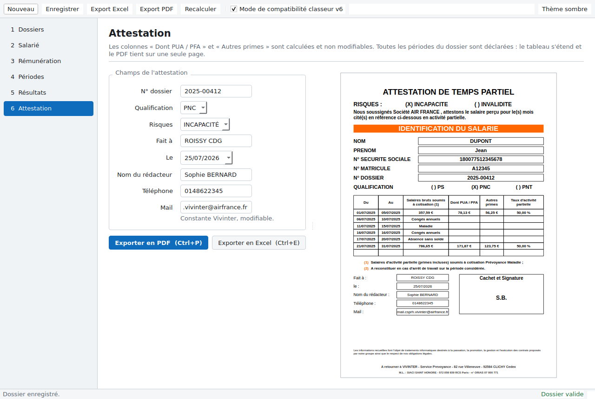

# Guide utilisateur — Calculateur TPT / Attestation Vivinter

Ce guide remplace le MODOP du classeur. Il s'adresse au service RH d'Air France
à Roissy-CDG.

---

## 1. Installation

L'application est un exécutable autonome : **aucune installation, aucun droit
administrateur, aucun accès Internet, et Microsoft Office n'est pas requis**.

1. Copiez `CalculateurTPT.exe` sur votre poste, sur un partage réseau ou sur une
   clé USB.
2. Double-cliquez dessus.

Au premier lancement, l'application crée un fichier `app.db` à côté de
l'exécutable : c'est l'historique local de vos dossiers. Si l'emplacement n'est
pas accessible en écriture (partage protégé, clé en lecture seule), la base est
créée dans votre profil Windows, sous
`%APPDATA%\CalculateurTPT\`.

> `app.db` contient des données personnelles de salariés. Il suit les mêmes
> règles de conservation et de confidentialité que les classeurs qu'il remplace.

---

## 2. Vue d'ensemble

L'application se parcourt en **six étapes**, dans le rail à gauche de la fenêtre.
Vous pouvez passer de l'une à l'autre à tout moment : **tout est recalculé à
chaque frappe**, il n'y a pas de bouton « Calculer ».



| Raccourci | Action |
|---|---|
| `Ctrl+N` | Nouveau dossier |
| `Ctrl+S` | Enregistrer le dossier |
| `Ctrl+E` | Exporter en Excel |
| `Ctrl+P` | Exporter en PDF |
| `F5` | Forcer le recalcul |

La **barre d'état**, en bas, rappelle en permanence le régime actif, le mois
traité, le nombre de périodes saisies et la validité du dossier.

Le bouton **Thème sombre**, en haut à droite, bascule l'affichage. Toute
l'application est navigable au clavier.

---

## 3. Étape 1 — Dossiers

La liste des dossiers déjà enregistrés, du plus récemment modifié au plus ancien.

- **Rechercher** : tapez un nom, un prénom ou un matricule.
- **Filtrer** : par régime, ou par mois au format `AAAA-MM`.
- **Nouveau** : démarre un dossier vierge.
- **Importer un classeur…** : reprend un dossier depuis un fichier `.xlsx`
  existant (voir §9).
- **Ouvrir** / **Supprimer** : sur la ligne sélectionnée. Un double-clic ouvre.

---

## 4. Étape 2 — Salarié



Choisissez d'abord le **régime** — un dossier relève d'un seul régime à la fois :

| Régime | Usage | Périodes |
|---|---|---|
| **ML35** | Perte d'indemnités journalières | 8 maximum |
| **ML36** | Temps partiel thérapeutique | 10 maximum |
| **ML37** | Accident du travail | 10 maximum |

Seuls **ML36 et ML37 alimentent l'attestation Vivinter**. Un dossier ML35 produit
une perte à déclarer, pas une attestation de temps partiel.

Renseignez ensuite l'identité, la DJT, le **mois traité** et le **nombre de jours
du mois**. Le champ **Date AT** n'apparaît que pour ML35 et ML37 : la matrice
ML36 ne comporte pas cette donnée.

> Le nombre de jours du mois sert de diviseur au calcul des 30èmes : il détermine
> tous les montants. Si vous saisissez un nombre différent du nombre réel de jours
> du mois, l'application vous le signale sans bloquer — la saisie manuelle reste
> possible pour reproduire un dossier historique.

---

## 5. Étape 3 — Rémunération



Tous les montants sont saisis **à 100 %**. Les champs **grisés sont calculés** et
ne peuvent pas être modifiés :

- **Base salariale** = somme de TMF, P. TRANSFERT et des trois lignes libres.
- **Total majorations** = somme des majorations et des trois lignes libres.
- **Montant réintégré** = montant SIACI × 24,5 %.
- **Perte PUA** = PUA − PUA perçue.

Le champ **Autres primes** est ventilé au prorata des 30èmes et alimente la
colonne « Autres primes » de l'attestation. Il était auparavant saisi à la main
sur l'attestation ; il est désormais calculé.

Les taux se saisissent en pourcentage : tapez `40` pour 40 %.

---

## 6. Étape 4 — Périodes



Une ligne = une période continue, avec :

| Colonne | Contenu |
|---|---|
| **Motif principal** | `ML36`, ou `ML37` / `CA`, ou `ML35` / `CA` selon le régime |
| **Motif d'absence** | à ne renseigner que si la période est une absence |
| **Du** / **Au** | dates au format `JJ/MM/AAAA`, calendrier français |
| **Nb jours**, **30ème** | calculés |

Les boutons **Ajouter**, **Supprimer**, **Monter** et **Descendre** gèrent la
liste.

### Saisir une date

Deux méthodes, au choix :

- **Au clavier** : tapez directement les chiffres. Sur un champ vide, la première
  frappe amorce la date du jour, puis vous corrigez le jour, le mois et l'année ;
  `←` et `→` passent d'une partie à l'autre, `↑` et `↓` incrémentent.
- **Au calendrier** : cliquez sur la flèche. Le calendrier s'ouvre sur le **mois
  et l'année en cours**, la semaine commence le lundi. Refermer sans cliquer
  laisse le champ vide.

> **Point important.** Dans le classeur, il fallait saisir les dates tantôt sur la
> ligne « période », tantôt sur la ligne « motif », selon la liste déroulante
> utilisée — et se tromper de ligne cassait silencieusement le calcul. Ce piège
> n'existe plus : une période est une seule ligne, et l'application place les
> dates au bon endroit.

Une période portant un motif d'absence **ne compte pas dans les 30èmes** : elle
n'est pas rémunérée, et n'entre donc pas dans la ventilation des primes.

### Contrôles

Les erreurs s'affichent **sous le champ concerné**, jamais dans une fenêtre
bloquante : chevauchement de périodes, dates hors du mois traité, somme des jours
supérieure au nombre de jours du mois, motif manquant ou inconnu, taux
incohérent, numéro de sécurité sociale de longueur inattendue.

---

## 7. Étape 5 — Résultats



La synthèse des totaux et le détail période par période :
`SALAIRE RETABLI 3201`, `PERTE CPAM`, `PERÇU CPAM`, `VIVINTER — perçu déclaré`,
somme des 30èmes et absences sans solde.

### L'avertissement « mode de compatibilité »

Un bandeau orangé peut apparaître : il signale que le **mode de compatibilité
classeur v6** et le **calcul corrigé** ne donnent pas le même résultat sur ce
dossier, et chiffre l'écart poste par poste.

Cela concerne exclusivement les dossiers **repris d'un classeur** dans lesquels
les dates d'une période d'absence avaient été saisies sur la ligne « période ».
Le classeur leur attribuait un salaire à tort ; l'application sait faire les deux.

Le mode est réglable dans la barre du haut. **Il est activé par défaut**, afin
que l'application reproduise le classeur tant que le service paie n'a pas
tranché. Voir `ANOMALIES.md`, §9.1.

---

## 8. Étape 6 — Attestation



À gauche, les seuls champs restant à saisir : n° de dossier, qualification
(`PS` / `PNC` / `PNT`), risque (`INCAPACITÉ` / `INVALIDITÉ`), lieu, date, nom du
rédacteur et téléphone. Le mail Vivinter est pré-rempli.

Les **initiales du rédacteur** sont reprises automatiquement dans la case
« Cachet et Signature » : « Sophie BERNARD » y inscrit `S.B.`. Les civilités sont
ignorées et les prénoms composés conservés (« Anne-Marie DUPONT » → `A.M.D.`).

À droite, **l'aperçu se met à jour à chaque frappe** et reproduit le document
final.

### Ce que l'attestation reprend automatiquement

Pour chaque ligne, l'application prend la période de même rang dans
ML36 ; si elle est vide, celle de ML37. La sélection est faite **ligne par
ligne** : une attestation peut mélanger des lignes ML36 et ML37, chacune avec son
propre montant et son propre taux.

La colonne « Salaires bruts soumis à cotisation » affiche le **motif** dès que la
période en porte un — `Maladie`, `Congés annuels`, `Absence sans solde` — et le
montant sinon. Le motif prime toujours sur le montant.

Les colonnes « Dont PUA / PFA » et « Autres primes » restent **vides** lorsque le
montant vaut zéro. Le taux d'activité partielle n'apparaît que sur les lignes
portant un montant.

### Exporter

**Exporter en PDF** (`Ctrl+P`) et **Exporter en Excel** (`Ctrl+E`). Les fichiers
sont nommés automatiquement :

```
ATTESTATION_VIVINTER_{NOM}_{MATRICULE}_{AAAA-MM}.pdf
```

Le PDF tient sur une page A4 et reproduit la charte Vivinter. Le fichier Excel est
le classeur d'origine, mise en forme intacte, dont toutes les formules ont été
remplacées par les valeurs calculées : il reste ouvrable et auditable sans
recalcul.

### Plus de 7 périodes

**Toutes vos périodes sont déclarées**, quel qu'en soit le nombre. Le formulaire
Vivinter n'en prévoyait que 7 : au-delà, l'application ajoute les lignes
nécessaires au tableau et décale le bas du document en conséquence. Le PDF tient
toujours sur **une seule page A4** — les lignes se resserrent légèrement.

Un dossier de 7 périodes ou moins produit un document identique à celui du
formulaire d'origine.

Le nombre de périodes reste limité à **10 par dossier** (8 en ML35) : c'est la
structure des matrices du classeur qui l'impose, pas l'attestation.

---

## 9. Reprendre un dossier du classeur Excel

Étape **Dossiers** → **Importer un classeur…**, puis choisissez le fichier
`.xlsx`.

L'application lit les trois matrices, détecte le régime d'après les périodes
réellement saisies, et **récupère les dates où qu'elles se trouvent** — ligne
« période » ou ligne « motif ». Le dossier importé reproduit donc exactement les
montants du classeur d'origine.

Si un bandeau d'écart apparaît à l'étape « Résultats », c'est que ce dossier est
concerné par l'anomalie décrite au §7.

---

## 10. Questions fréquentes

**Les montants ne correspondent pas à mon classeur.**
Vérifiez d'abord le **nombre de jours du mois** : c'est le diviseur de tous les
30èmes. Vérifiez ensuite le bandeau d'écart à l'étape « Résultats ».

**Pourquoi la colonne « Autres primes » n'est-elle plus modifiable ?**
Elle est désormais calculée : le montant saisi à l'étape « Rémunération » est
ventilé au prorata des 30èmes de chaque période.

**Une période d'absence affiche 0,00 € partout, est-ce normal ?**
Oui. Une période d'absence n'est pas rémunérée : elle ne compte pas dans les
30èmes et ne reçoit aucune quote-part de primes.

**J'ai perdu mes dossiers.**
Ils sont dans `app.db`, à côté de l'exécutable ou dans
`%APPDATA%\CalculateurTPT\`. Copiez ce fichier pour les transférer sur un autre
poste.

**Puis-je travailler à plusieurs sur la même base ?**
Non. `app.db` est une base locale, prévue pour un poste. Pour partager un dossier,
exportez-le en Excel et réimportez-le.
